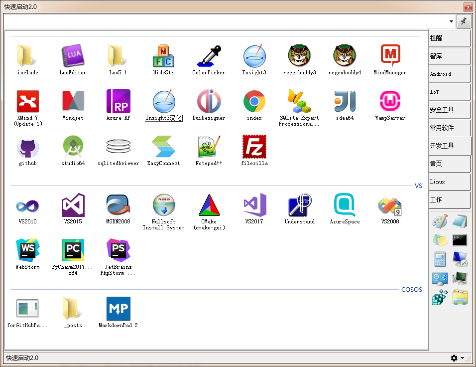
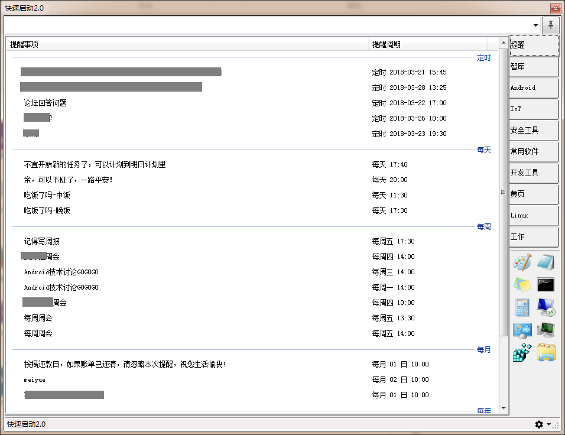
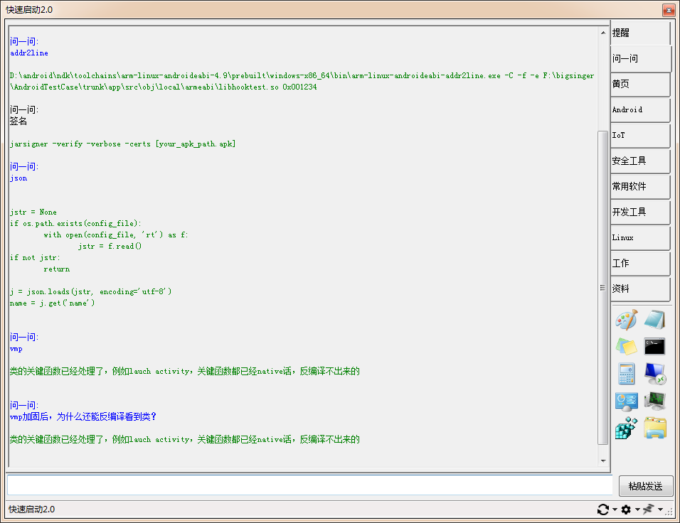

# smartrun（快速启动）
## 前言
Windows下的一款工具，主要是为了提高自己工作效率的。当然，网上也能搜索下载到此类的工具，但是一般不够纯净，也比较笨重，索性自己动手写了一个。

本工具不是everything，如果非要对比的话，其实我想使用类似Wox的工具，但是这个工具有点重，所以没有去使用。Wox是个开源的WPF项目，代码有点多，看不来……

考虑到时间有限，采用了C#开发的，开发起来比较简单，但是运行效率就没有上个版本快了，但是增加了一些功能。如果全部都用C++开发，恐怕自己没那个时间。

因为自己觉得好用，所以想分享给大家，如果对你的工作有帮助那最好不过，如果没用就请跳过。

工具目前有以下功能，后面逐个详细介绍：
- 文件工具管理
- 截图
- 提醒
- 快捷短语
- 智库

## 使用方法
- ALT + A 呼出热键（切换窗口的显示和隐藏）。
- ALT + X 截图热键。

如果快捷键跟其他软件有冲突，可以把其他软件的快捷键删除掉，目前本工具不支持自定义热键。

## 文件工具管理:
这个功能是最先设计的，也是工作的痛点之一。主要是将文件、工具、快捷方式等分门别类。

使用时先创建大分组，然后把文件拖放进来即可。

可以支持子分组，右键创建子分组，然后右键把项目发送到子分组即可。

也支持创建网址，这里先不写的。

也可以直接编辑shotcuts.xml文件，XML格式，看看就晓得了。

## 截图
为了快速开发，实现功能效果，这里直接复用了QQ聊天工具里的截图库文件：PrScrn.dll，这个文件在微信里也有，但是体积较大，对比了下功能基本没有变化，所以我挑选了一个体积较小的使用。

**ALT + X **截图热键

## 提醒：
本来不打算开发这个功能的，因为同类型的软件很多，一直以来使用闪电邮的提醒功能，虽然体验并不是很好，但是勉强能用。后来邮箱大师粉墨登场，大有替换闪电邮的气势，用下来发现提醒功能很蹩脚，每次创建一个提醒很是浪费时间，而且有很多BUG，反馈无果，算了，还是自己动手实现吧。

一切都是为了节省时间，所以实现的提醒很是简单，但是对我来说已经足够，创建也足够编辑，提醒也足够了，而且不会遗漏。

## 快捷短语:
这个是支持扩展的，但是我不打算写说明，有空再写吧。

先偷偷告诉你两个快捷短语：ip、mac，在工具顶部的编辑框中输入后会显示当前机器的IP地址和MAC地址，选中按下回车键，自动复制到剪贴板。

## 智库（智能问答）
设计初衷：利用某个机器（个人电脑或者树莓派）搭建一个小型服务器，配置好问答库，然后本工具提问到服务器，自动收到回复。

目前测试是本机搭建的，服务器端用了Python的pickle库。如果开启了服务器，则演示效果如下：

例如，我记不得签名的命令行是什么，我配置到服务器，然后想查询签名命令的时候，“问”一下即可。

当然也可以作为智能客服和常见问题的回答。

这一块比较适合没有什么资源的个人或者小团体使用，因为不需要服务器资源，搭建起来分分钟。有条件的建议还是用微信公众号的自动回复比较高端。

## 遗留问题
因为时间有限，很多情况并没有考虑，也没有经过严格测试，仅仅是为了方便自己工作而作，所以如果创建了不合法的文件导致的程序崩溃，概不负责。

如果有好的建议和问题反馈，请在issues里提，当然我不一定有空解决。
